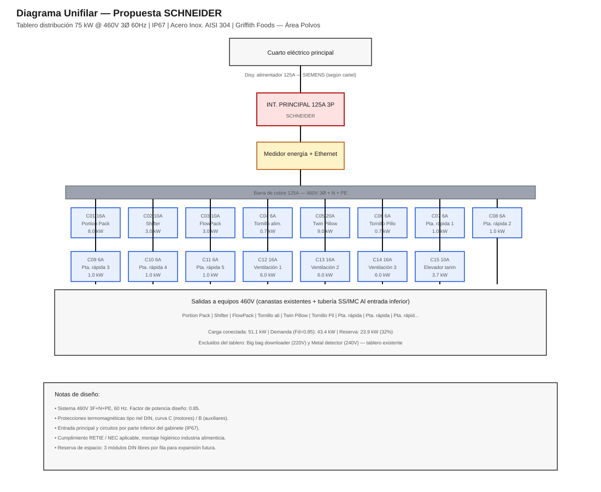
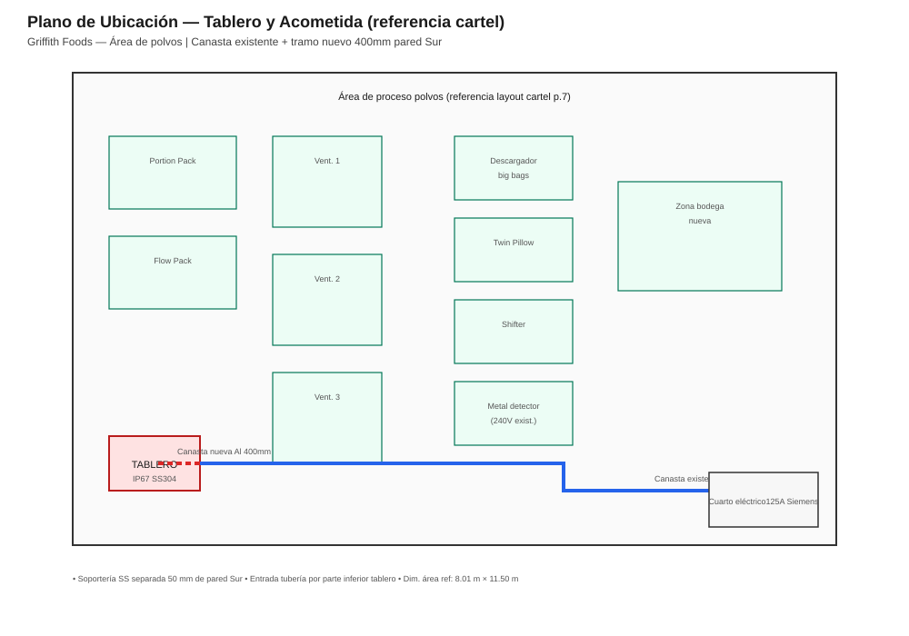
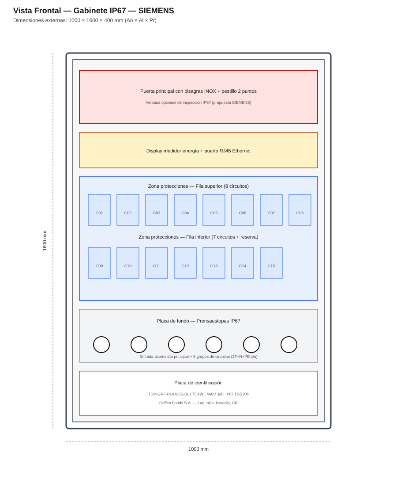

# Propuesta Técnico-Económica — Tablero de Distribución 75 kW @ 460V
## Griffith Foods S.A. — Área de Polvos, Lagunilla de Heredia

**Documento:** Análisis de licitación y propuestas comparativas  
**Fecha:** 26 de agosto de 2026  
**Alcance:** Tablero de distribución + acometida principal (Fase 1 del cartel)

---

## 1. Resumen ejecutivo

El cartel solicita un **tablero tipo gabinete en acero inoxidable IP67** con capacidad de **75 kW @ 460 V**, disyuntor principal, medidor de energía con **Ethernet**, y protecciones **tipo riel DIN** para alimentar los equipos del área de polvos.

| Parámetro | Valor |
|---|---|
| Carga conectada 460 V | **51.1 kW** (15 circuitos) |
| Demanda calculada (Fd = 0.85) | **43.4 kW** (~64 A) |
| Capacidad nominal tablero | **75 kW** (~111 A) |
| Reserva de capacidad | **23.9 kW (32 %)** |
| Alimentador aguas arriba (cartel) | **125 A Siemens** en cuarto eléctrico |
| Protección gabinete | **≥ IP67**, acero inoxidable |
| Entrada cables | **Parte inferior** (tubería SS o IMC Al) |

**Equipos excluidos del tablero** (alimentación desde tablero existente, según nota del cartel):
- Big bag downloader — 220 V, 3Ø, 2.0 kW  
- Metal detector — 240 V, 1Ø, 0.7 kW  

---

## 2. Diagrama unifilar y ubicación

### Diagrama unifilar — Propuesta SIEMENS

### Diagrama unifilar — Propuesta SCHNEIDER

### Plano de ubicación (referencia cartel)

---

## 3. Cálculos eléctricos

### 3.1 Fórmulas utilizadas

**Corriente trifásica:**
\[
I = \frac{P \times 1000}{\sqrt{3} \times V \times FP}
\]

Donde: V = 460 V, FP = 0.85 (motores industriales), f = 60 Hz.

**Corriente a 75 kW (capacidad tablero):**
\[
I_{75kW} = \frac{75000}{1.732 \times 460 \times 0.85} = 110.7 \text{ A}
\]

**Selección interruptor principal:** 125 A (coincide con alimentador Siemens exigido en cartel).

### 3.2 Tabla de circuitos

| Cto | Equipo | kW | I calc. (A) | Disyuntor | Cable THWN Cu |
|:---:|---|---:|---:|:---:|---|
| C01 | Portion pack powder | 8.0 | 11.81 | 16 A 3P | 12 AWG |
| C02 | Shifter | 3.0 | 4.43 | 10 A 3P | 12 AWG |
| C03 | FlowPack | 3.0 | 4.43 | 10 A 3P | 12 AWG |
| C04 | Tornillo alimentación | 0.7 | 1.03 | 6 A 3P | 12 AWG |
| C05 | Twin pillow filler | 9.0 | 13.29 | 20 A 3P | 12 AWG |
| C06 | Tornillo alimentación Pillow | 0.7 | 1.03 | 6 A 3P | 12 AWG |
| C07 | Puerta rápida 1 | 1.0 | 1.48 | 6 A 3P | 12 AWG |
| C08 | Puerta rápida 2 | 1.0 | 1.48 | 6 A 3P | 12 AWG |
| C09 | Puerta rápida 3 | 1.0 | 1.48 | 6 A 3P | 12 AWG |
| C10 | Puerta rápida 4 | 1.0 | 1.48 | 6 A 3P | 12 AWG |
| C11 | Puerta rápida 5 | 1.0 | 1.48 | 6 A 3P | 12 AWG |
| C12 | Ventilación 1 | 6.0 | 8.86 | 16 A 3P | 12 AWG |
| C13 | Ventilación 2 | 6.0 | 8.86 | 16 A 3P | 12 AWG |
| C14 | Ventilación 3 | 6.0 | 8.86 | 16 A 3P | 12 AWG |
| C15 | Elevador tarimas | 3.7 | 5.46 | 10 A 3P | 12 AWG |
| | **TOTAL** | **51.1** | **75.5** | | |

> **Criterio de protección:** Curva C para cargas motorizadas (125 % In), curva B para auxiliares ≤ 1 kW (110 % In). Coordina con arranques directos; si algún equipo requiere variador o arrancador suave, el cartel debe confirmarse en visita de sitio.

### 3.3 Acometida principal al tablero

| Parámetro | Valor |
|---|---|
| Corriente de diseño | 125 A |
| Conductor propuesto | **3 × 1/0 AWG Cu THWN-2 + 1 × 2 AWG tierra** |
| Caída de tensión máx. | ≤ 3 % (tramo estimado 30 m)* |
| Canalización | Canasta Al 400 mm (tramo nuevo) + existente |
| Entrada tablero | Tubería SS 2" o IMC Al + prensas IP67 |

*\*Longitud exacta marcada como "XXX m" en cartel — confirmar en visita de sitio (17 ago 2026).*

---

## 4. Propuesta A — SIEMENS (Premium)

### 4.1 Filosofía de diseño
Solución integral Siemens Sentron para máxima trazabilidad, medición Ethernet nativa y compatibilidad con el disyuntor Siemens 125 A exigido aguas arriba.

### 4.2 Vista frontal del gabinete

### 4.3 Dimensiones del gabinete

| Dimensión | Valor |
|---|---|
| Ancho externo | 1000 mm |
| Alto externo | 1600 mm |
| Profundidad | 400 mm |
| Material | Acero inoxidable **AISI 304** escobillado |
| Protección | **IP67** (puerta con espuma silicona grado alimenticio) |
| Montaje | Pedestal SS 200 mm o soporte mural (definir en sitio) |
| Peso estimado | ~185 kg |

### 4.4 Lista de materiales — SIEMENS

| Ítem | Descripción | Cant. | P. Unit. USD | Total USD |
|:---:|---|---:|---:|---:|
| 1 | Gabinete SS304 IP67 1000×1600×400 mm (Rittal VX SS / equivalente) | 1 | 4,850 | 4,850 |
| 2 | Interruptor principal **Siemens 3VA1225-5ED32-0AA0** 125 A 3P 35 kA @ 480V | 1 | 1,920 | 1,920 |
| 3 | Medidor **SENTRON PAC3200** + módulo Ethernet PROFINET | 1 | 1,050 | 1,050 |
| 4 | TC externos 125/5 A clase 0.5 (para medidor) | 3 | 85 | 255 |
| 5 | DPS **5SD7** 440 V 3P+N (protección sobretensión) | 1 | 320 | 320 |
| 6 | **5SL6** 6 A 3P curva C (C04,C06-C11) | 8 | 48 | 384 |
| 7 | **5SL6** 10 A 3P curva C (C02,C03,C15) | 3 | 52 | 156 |
| 8 | **5SL6** 16 A 3P curva C (C01,C12-C14) | 4 | 55 | 220 |
| 9 | **5SL6** 20 A 3P curva C (C05) | 1 | 58 | 58 |
| 10 | Barras de cobre 125 A + aisladores + cubiertas | 1 lote | 480 | 480 |
| 11 | Riel DIN, canal desviador, borneras Phoenix 16 mm² | 1 lote | 620 | 620 |
| 12 | Prensaestopas SS IP68 M40/M32 (grupo cables) | 18 | 28 | 504 |
| 13 | Cableado interno, etiquetado, planos as-built | 1 lote | 980 | 980 |
| 14 | Placa identificación grabada SS + esquema unifilar laminado | 1 | 120 | 120 |
| | **Subtotal materiales tablero** | | | **11,909** |
| 15 | Fabricación, montaje, pruebas FAT | 1 lote | 3,600 | 3,600 |
| 16 | Ingeniería, memorias, protocolos | 1 lote | 1,800 | 1,800 |
| | **Subtotal tablero instalado** | | | **17,309** |

### 4.5 Acometida principal — SIEMENS

| Ítem | Descripción | Cant. | P. Unit. USD | Total USD |
|:---:|---|---:|---:|---:|
| 17 | Disyuntor alimentador **Siemens 3VA1225** 125 A 3P (cuarto eléctrico)* | 1 | 1,920 | 1,920 |
| 18 | Cable 3×1/0 + 1×2 AWG Cu THWN (~30 m) | 30 m | 42 | 1,260 |
| 19 | Canaleta aluminio 400 mm + tapa + accesorios (~12 m nuevo) | 12 m | 95 | 1,140 |
| 20 | Soportería SS304 separación 50 mm pared | 1 lote | 680 | 680 |
| 21 | Tubería SS 2" + curvas + conectores IP67 entrada inferior | 1 lote | 920 | 920 |
| 22 | Instalación, tendido, pruebas, megado | 1 lote | 2,600 | 2,600 |
| | **Subtotal acometida** | | | **8,520** |

*\*El cartel exige marca Siemens para este disyuntor.*

### 4.6 **TOTAL PROPUESTA A — SIEMENS: USD 25,829**

---

## 5. Propuesta B — SCHNEIDER ELECTRIC (Optimizada)

### 5.1 Filosofía de diseño
Solución Schneider Acti9 + PowerLogic con excelente relación costo/beneficio. El disyuntor del cuarto eléctrico se mantiene **Siemens 125 A** según exigencia del cartel; el tablero usa componentes Schneider.

### 5.2 Vista frontal del gabinete

### 5.3 Dimensiones del gabinete

| Dimensión | Valor |
|---|---|
| Ancho externo | 1000 mm |
| Alto externo | 1600 mm |
| Profundidad | 400 mm |
| Material | Acero inoxidable **AISI 304** |
| Protección | **IP67** |
| Peso estimado | ~180 kg |

*Misma envolvente que Propuesta A para comparación equitativa.*

### 5.4 Lista de materiales — SCHNEIDER

| Ítem | Descripción | Cant. | P. Unit. USD | Total USD |
|:---:|---|---:|---:|---:|
| 1 | Gabinete SS304 IP67 1000×1600×400 mm | 1 | 4,850 | 4,850 |
| 2 | Interruptor principal **Schneider NSX100F/NSX125F** 125 A 3P3D 36 kA | 1 | 1,680 | 1,680 |
| 3 | Medidor **PowerLogic PM5320** + Ethernet integrado | 1 | 1,120 | 1,120 |
| 4 | TC 125/5 A clase 0.5 | 3 | 78 | 234 |
| 5 | DPS **iPRD1** 12,5r 3P+N | 1 | 290 | 290 |
| 6 | **Acti9 iC60N** 6 A 3P curva C | 8 | 42 | 336 |
| 7 | **Acti9 iC60N** 10 A 3P curva C | 3 | 44 | 132 |
| 8 | **Acti9 iC60N** 16 A 3P curva C | 4 | 46 | 184 |
| 9 | **Acti9 iC60N** 20 A 3P curva C | 1 | 48 | 48 |
| 10 | Barras, rieles, borneras Linergy | 1 lote | 520 | 520 |
| 11 | Prensaestopas SS IP68 | 18 | 28 | 504 |
| 12 | Cableado, etiquetado, planos | 1 lote | 980 | 980 |
| 13 | Placa identificación SS | 1 | 120 | 120 |
| | **Subtotal materiales tablero** | | | **11,994** |
| 14 | Fabricación, montaje, pruebas FAT | 1 lote | 3,600 | 3,600 |
| 15 | Ingeniería, memorias, protocolos | 1 lote | 1,800 | 1,800 |
| | **Subtotal tablero instalado** | | | **17,394** |

### 5.5 Acometida principal — SCHNEIDER*

| Ítem | Descripción | Cant. | P. Unit. USD | Total USD |
|:---:|---|---:|---:|---:|
| 16 | Disyuntor **Siemens 3VA1225** 125 A 3P (cuarto eléctrico — exigido) | 1 | 1,920 | 1,920 |
| 17-22 | *(Mismos ítems de canalización e instalación que Propuesta A)* | — | — | 6,600 |
| | **Subtotal acometida** | | | **8,520** |

### 5.6 **TOTAL PROPUESTA B — SCHNEIDER: USD 25,914**

---

## 6. Comparativo de propuestas

| Concepto | Propuesta A SIEMENS | Propuesta B SCHNEIDER |
|---|--:|--:|
| Tablero + componentes | $17,309 | $17,394 |
| Acometida principal | $8,520 | $8,520 |
| **TOTAL USD** | **$25,829** | **$25,914** |
| Medidor Ethernet | PAC3200 (PROFINET/Ethernet) | PM5320 (Ethernet nativo) |
| Interruptor principal tablero | Siemens 3VA1 | Schneider NSX125F |
| Curva de disparo | TM240 ajustable | TM-D ajustable |
| Ventaja principal | Ecosistema unificado Siemens | PM5320 más económico en licencias web |
| Tiempo entrega estimado | 6–8 semanas | 5–7 semanas |

> **Nota sobre precios:** Valores referenciales USD para mercado Costa Rica (ago 2026), incluyen materiales e instalación. No incluyen IVA. Precios firmes sujetos a confirmación de longitud de acometida (XXX m) en visita de sitio.

---

## 7. Cumplimiento del cartel

| Requisito cartel | Propuesta A | Propuesta B |
|---|:---:|:---:|
| Capacidad 75 kW @ 460 V | ✅ | ✅ |
| Gabinete IP67 acero inoxidable | ✅ | ✅ |
| Disyuntor principal | ✅ | ✅ |
| Medidor energía + Ethernet | ✅ | ✅ |
| Breakers riel DIN por circuito | ✅ | ✅ |
| Disyuntor 125 A Siemens (cuarto eléctrico) | ✅ | ✅ |
| Entrada cables por debajo | ✅ | ✅ |
| Montaje ordenado (Estándares diseño GF) | ✅ | ✅ |

---

## 8. Entregables incluidos

1. Planos unifilares y de layout (incluidos en este documento)  
2. Memoria de cálculo eléctrico  
3. Lista de materiales con códigos de catálogo  
4. Protocolo FAT (Factory Acceptance Test)  
5. Protocolo SAT en sitio + megado de circuitos  
6. Manual de operación y planos as-built  
7. Etiquetado bilingüe de circuitos  

---

## 9. Observaciones y recomendaciones

1. **Confirmar longitud acometida** (cartel indica "XXX m") — impacto directo en costo de conductor y canaleta.  
2. **Declaración jurada** requerida si no asiste a visita del 17-ago-2026.  
3. **Plazo oferta:** Viernes 28-ago-2026, 15:00 h a jquesada@griffithfoods.com  
4. Se recomienda reservar **3 módulos DIN** por fila para futuras ampliaciones (incluido en diseño).  
5. Para ambientes con lavado frecuente, considerar upgrade a **AISI 316L** (+USD 1,200 aprox.).  
6. Equipos 220 V / 240 V deben verificarse en tablero existente con capacidad disponible.

---

## 10. Formato resumen para oferta económica (Cartel Cuadro 2)

| Entregable | Prop. A SIEMENS | Prop. B SCHNEIDER |
|---|--:|--:|
| **Tablero de distribución y acometida principal** | **$25,829** | **$25,914** |
| Circuitos de equipos e iluminación | Cotización separada* | Cotización separada* |
| Tubería de agua caliente | Cotización separada* | Cotización separada* |
| Tubería de agua | Cotización separada* | Cotización separada* |
| Tubería de aire comprimido | Cotización separada* | Cotización separada* |

*\*Este documento cubre exclusivamente el ítem "Tablero de distribución y acometida principal" según su solicitud.*

---

*Documento generado para apoyo a la cotización. Los dibujos SVG se encuentran en la carpeta `dibujos/`.*
